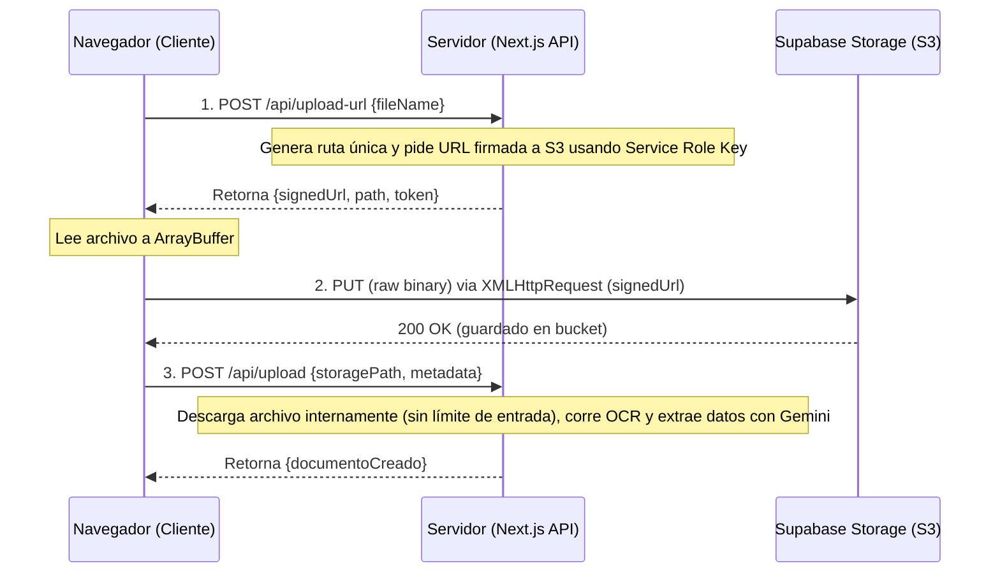

# Guía de Arquitectura: Subida Resiliente de Archivos Pesados y Procesamiento OCR con IA
## Arquitectura: Next.js + Vercel Serverless + Supabase Storage (o compatible con S3)

Esta guía documenta el patrón arquitectónico, los problemas encontrados en producción real (con archivos de más de 30MB) y las soluciones definitivas aplicadas en la plataforma ERFOR. Es de utilidad para proyectos con flujos de carga masiva de PDF escaneados o documentos grandes en arquitecturas serverless.

---

## 🗺️ 1. Arquitectura del Pipeline de Carga

En entornos serverless como Vercel, no se deben subir archivos pesados directamente a través de las funciones serverless de la aplicación por dos límites técnicos duros:
1. **Límite de Request Body (4.5 MB en Vercel):** Cualquier petición que supere este tamaño es rechazada en el edge con un `413 Payload Too Large`.
2. **Tiempo de ejecución (10s a 60s):** Mantener un socket abierto para transmitir megabytes de datos consume tiempo valioso de ejecución de CPU serverless.

### El Flujo Recomendado (Subida Directa por URL Firmada)



---

## 🚨 2. Problemas Críticos en Producción y sus Soluciones

### Problema A: Fallo de codificación de cabeceras multipart en archivos grandes
* **Síntoma:** Error `Failed to execute 'set' on 'Headers': String contains non ISO-8859-1 code point` en el navegador del usuario al subir archivos grandes (ej. 33MB), mientras que en local o con archivos pequeños funcionaba.
* **Causa Raíz:** Por defecto, los SDKs de almacenamiento (como `@supabase/storage-js`) envuelven los objetos `File` o `Blob` en un `FormData` multipart. Al realizar peticiones multipart muy grandes, las capas de inspección de red locales (antivirus como Kaspersky/ESET, proxies corporativos o sistemas DLP) interceptan la subida en el navegador, alteran/reconstruyen las cabeceras multipart para inyectar metadatos y corrompen la codificación introduciendo caracteres no-ISO-8859-1.
* **Remediación:** Convertir el archivo a un buffer binario crudo en memoria (`ArrayBuffer`) del lado del cliente y transmitirlo mediante un método HTTP **`PUT` directo**, sin envolverlo en `FormData`. Esto genera una petición limpia con cabeceras estándar ASCII.

### Problema B: Interferencia y "Monkeypatching" de `fetch` por extensiones de navegador
* **Síntoma:** Incluso enviando el `ArrayBuffer` con `fetch` nativo de forma limpia, seguía arrojando `TypeError: Failed to read the 'headers' property from 'RequestInit': String contains non ISO-8859-1 code point`.
* **Causa Raíz:** Las extensiones de seguridad, antivirus o gestores de contraseñas de los navegadores empresariales interceptan y sobrescriben la función global `window.fetch` para auditar el tráfico. Cuando detectan subidas pesadas, modifican el objeto `RequestInit.headers` del `fetch` nativo del navegador de manera incorrecta.
* **Remediación:** Utilizar la API clásica **`XMLHttpRequest` (XHR)** en lugar de la API de `fetch`. XHR opera en un nivel más bajo del navegador y no expone el diccionario `RequestInit`, saltándose por completo cualquier monkeypatch o interceptor inyectado en `window.fetch` por extensiones de terceros.

### Problema C: Crash de librerías WebAssembly (WASM) en Serverless (OCR)
* **Síntoma:** La subida se completaba exitosamente en el navegador, pero el endpoint de procesamiento final daba un `504 Gateway Timeout` (60s) en Vercel, y los logs reportaban: `ENOENT: no such file or directory, open tesseract-core-relaxedsimd.wasm`.
* **Causa Raíz:** Al procesar un PDF escaneado (sin texto copiable), el servidor cae en el fallback de hacer OCR con `tesseract.js`. Esta librería carga dinámicamente binarios WebAssembly (`.wasm`) desde `node_modules/tesseract.js-core`. Sin embargo, el file tracer de Next.js (`nft`) no detecta estas importaciones dinámicas durante el build, por lo que Vercel **no incluye** los archivos `.wasm` en el contenedor serverless resultante.
* **Remediación:** Forzar el copiado de los archivos utilizando `outputFileTracingIncludes` en el archivo de configuración `next.config.ts`.

---

## 💻 3. Código de Implementación de Referencia

### A. Cliente: Helper de Carga Directa (Bypass de Fetch y Multipart)
Este es el código limpio a utilizar en el frontend:

```typescript
/**
 * Sube un archivo directamente a una URL firmada de almacenamiento utilizando XMLHttpRequest.
 * Bypassea validaciones de fetch de extensiones de seguridad y optimiza el consumo de memoria.
 */
export async function uploadFileDirect(
  file: File,
  fields: Record<string, string | undefined>
): Promise<any> {
  // 1. Solicitar URL firmada al servidor
  const urlRes = await fetch("/api/documents/upload-url", {
    method: "POST",
    headers: { "Content-Type": "application/json" },
    body: JSON.stringify({ fileName: file.name })
  });
  const urlData = await urlRes.json();
  if (!urlRes.ok) throw new Error(urlData?.error || "Error al preparar URL de subida");

  const supabaseAnonKey = process.env.NEXT_PUBLIC_SUPABASE_ANON_KEY || "";

  try {
    // Convertir el archivo a ArrayBuffer nativo (cuerpo binario crudo)
    const fileArrayBuffer = await file.arrayBuffer();

    // Sanitizar cabeceras proactivamente eliminando cualquier carácter fuera del rango ISO-8859-1 (0x00-0xFF)
    const cleanContentType = (file.type || "application/octet-stream").trim().replace(/[^\x00-\xFF]/g, "");
    const cleanAnonKey = supabaseAnonKey.trim().replace(/[^\x00-\xFF]/g, "");

    const headersConfig: Record<string, string> = {
      "apikey": cleanAnonKey,
      "Authorization": `Bearer ${cleanAnonKey}`,
      "Content-Type": cleanContentType,
      "cache-control": "max-age=3600",
      "x-upsert": "false"
    };

    // Subida mediante XMLHttpRequest para evitar interceptores de window.fetch
    const xhr = new XMLHttpRequest();
    xhr.open("PUT", urlData.signedUrl, true);
    
    for (const [key, value] of Object.entries(headersConfig)) {
      xhr.setRequestHeader(key, value);
    }

    const uploadPromise = new Promise<void>((resolve, reject) => {
      xhr.onload = () => {
        if (xhr.status >= 200 && xhr.status < 300) {
          resolve();
        } else {
          reject(new Error(`HTTP ${xhr.status}: ${xhr.responseText || xhr.statusText}`));
        }
      };
      xhr.onerror = () => reject(new Error("Error de red en XHR"));
      xhr.onabort = () => reject(new Error("Carga abortada"));
    });

    xhr.send(fileArrayBuffer);
    await uploadPromise;

  } catch (error: any) {
    throw new Error(`Error en subida binaria directa: ${error.message || String(error)}`);
  }

  // 3. Notificar al servidor finalización para que inicie la extracción
  const finalizeRes = await fetch("/api/documents/upload", {
    method: "POST",
    headers: { "Content-Type": "application/json" },
    body: JSON.stringify({
      storagePath: urlData.path,
      fileName: file.name,
      fileType: file.type,
      fileSize: file.size,
      ...fields
    })
  });
  
  const finalizeData = await finalizeRes.json();
  if (!finalizeRes.ok) throw new Error(finalizeData?.error || "Error al procesar el archivo en servidor");

  return finalizeData;
}
```

### B. Servidor: Generación de la URL Firmada (`/api/documents/upload-url/route.ts`)
```typescript
import { createClient } from "@supabase/supabase-js";
import { NextResponse } from "next/server";

export async function POST(request: Request) {
  try {
    const { fileName } = await request.json();
    if (!fileName) return NextResponse.json({ error: "fileName requerido" }, { status: 400 });

    const supabaseUrl = process.env.SUPABASE_URL || "";
    // Es crítico usar la clave de rol de servicio (SERVICE_ROLE_KEY) solo en el servidor
    const supabaseKey = process.env.SUPABASE_SERVICE_ROLE_KEY || "";
    const supabase = createClient(supabaseUrl, supabaseKey);

    // Sanitizar el nombre del archivo para la ruta de almacenamiento
    const safeName = fileName.replace(/[^a-zA-Z0-9._-]/g, "_");
    const path = `documents/${Date.now()}-${safeName}`;

    // Generar URL firmada de subida en Supabase Storage
    const { data, error } = await supabase.storage.from("erfor-uploads").createSignedUploadUrl(path);
    if (error || !data) {
      return NextResponse.json({ error: "Error en el servidor de almacenamiento" }, { status: 500 });
    }

    // Retornamos la URL con token
    return NextResponse.json({ path, token: data.token, signedUrl: data.signedUrl });
  } catch (error: any) {
    return NextResponse.json({ error: error.message }, { status: 500 });
  }
}
```

### C. Configuración de Next.js: Trazado de WebAssembly (`next.config.ts`)
Configura la exportación selectiva de dependencias dinámicas para que no queden fuera del empaquetado final de Vercel:

```typescript
import type { NextConfig } from "next";

const nextConfig: NextConfig = {
  outputFileTracingIncludes: {
    // Forzamos el empaquetado de librerías nativas o dinámicas en los endpoints que procesan OCR
    "/api/documents/upload": [
      "./node_modules/@napi-rs/canvas-linux-*/**/*", // Para rasterizar PDFs a PNGs en Linux/Vercel
      "./node_modules/pdf-parse/node_modules/pdfjs-dist/legacy/build/**/*", // Worker de pdf-parse
      "./node_modules/tesseract.js-core/**/*" // Binarios .wasm y scripts de Tesseract para OCR
    ]
  },
  // Impedimos que el bundler procese estas librerías en tiempo de compilación (se cargan nativas)
  serverExternalPackages: ["pdf-parse", "tesseract.js", "@napi-rs/canvas", "pdfjs-dist"]
};

export default nextConfig;
```

---

## 📈 4. Buenas Prácticas Generales para Plataformas SaaS de Gestión Documental
1. **Separación de responsabilidades:** La subida es del navegador al almacenamiento. El servidor solo debe gestionar punteros de rutas de archivos (`storagePath`), nunca transmitir buffers en bruto desde el cliente.
2. **Sanitización defensiva:** Las tildes, caracteres especiales o nombres excesivamente largos en cabeceras HTTP son enemigos del protocolo web. Reemplázalos o codifícalos con `encodeURIComponent` si es obligatorio enviarlos.
3. **Control del tamaño en OCR:** El OCR es una operación costosa. Limita siempre la cantidad máxima de páginas iniciales sobre las cuales realizarás el escaneo (por ejemplo, solo las primeras 5 páginas del PDF) para evitar timeouts en funciones serverless.
